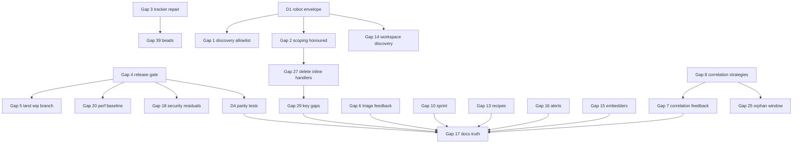

# Bridge Plan: beads_viewer (bv)

**Reality check date:** 2026-09-01
**Baseline:** main @ 03f92509, v0.22.0 + 39 commits, 541/541 beads closed, 0 open
**Gap count:** 5 critical, 16 major, 18 minor (39 gaps; 0 had bead coverage when found)
**Tracker:** repaired 2026-09-02 (see Gap 3); every gap below is now tracked
**New beads created:** 70 on 2026-09-02 (9 epics, 61 tasks, 93 dependency edges, 0 cycles; ids in section 8)
**Estimated work:** 9 workstreams, 3 to 5 agent-weeks of parallel work

This document is the Phase 2 artifact of the reality-check workflow. Phase 1 (the honest assessment) found that the product the README describes exists and runs, but that the README, several "intelligence" subsystems, the data-source layer, and the verification pipeline have drifted from the promise. This plan closes every gap found, in a way that keeps the codebase harmonized: one robot envelope, one discovery policy, no write-only state, and documentation that is tested against code so drift cannot recur.

It is written to be revised in place during ambition and refinement rounds, then converted into beads with the frozen bead-generation prompt. Every gap carries enough context that a bead derived from it needs no other document.

---

## 0. Cross-cutting design decisions

These decisions are the spine of the plan. Individual gaps reference them by ID.

### D1. One robot envelope, built in one place

Today each registry handler assembles its own top-level fields, which is why `as_of` appears in 6 of ~40 commands, `analysis_config` in some, `load_stats` only on drops, and the source file never. Introduce a single `RobotEnvelope` struct in `cmd/bv/robot_registry.go`, populated by one constructor from `RobotContext`, that every handler embeds:

```go
type RobotEnvelope struct {
    GeneratedAt    string           `json:"generated_at"`
    Version        string           `json:"version"`
    OutputFormat   string           `json:"output_format"`
    DataHash       string           `json:"data_hash"`
    SourcePath     string           `json:"source_path"`            // NEW: the JSONL/DB actually loaded
    SourceKind     string           `json:"source_kind"`            // NEW: jsonl|sqlite|git|workspace
    AsOf           string           `json:"as_of,omitempty"`
    AsOfCommit     string           `json:"as_of_commit,omitempty"`
    Scope          *RobotScope      `json:"scope,omitempty"`        // NEW: label/recipe/repo applied
    LoadStats      *RobotLoadStats  `json:"load_stats,omitempty"`
    AnalysisConfig *analysis.Config `json:"analysis_config,omitempty"`
    Status         map[string]any   `json:"status,omitempty"`
}
```

Handlers that today return ad-hoc maps switch to `struct { RobotEnvelope; ...payload }`. `--robot-schema` is regenerated from the envelope so the contract is machine-checkable.

### D2. Discovery allowlist, never a denylist

`internal/datasource/source.go` currently accepts any `*.jsonl` in `.beads/` minus a few names. Replace with an allowlist derived from `loader.PreferredJSONLNames` (`issues.jsonl`, `beads.jsonl`, `beads.base.jsonl`) plus an explicit override (`BEADS_DB`, `--db`). Sidecar files written by bv or br (`sprints.jsonl`, `sync_base.jsonl`, `correlation_feedback.jsonl`, `memories.jsonl`, `deletions.jsonl`, `interactions.jsonl`, `*.left/right`, `*.backup`) are never candidates. Candidate probing never prints warnings; only the selected source may warn.

### D3. No write-only state

Every persisted store must have a consumer whose effect is proven by a test. Stores that fail this rule either get their consumer implemented or are removed together with their flags and README sections. Affected: `.beads/feedback.json`, `.beads/correlation_feedback.jsonl`, `~/.config/bv/tutorial-progress.json`, the `pkg/metrics` globals.

### D4. Documentation is tested against code

Add `cmd/bv/doc_parity_test.go` and `pkg/ui/doc_parity_test.go` that parse README.md and assert:

- every `--flag` token in README is a defined pflag, and every defined flag (minus a short explicit allowlist of debug flags) appears in README;
- every `BV_*`/`BEADS_*` variable read via `os.Getenv` appears in the README environment table, and vice versa;
- every key in the README "Keyboard Control Map" and per-view tables resolves to a handled key for that focus (using the key registry, see Gap 27);
- the alert type list, recipe list, search preset list, and sort mode list in README equal the code's enumerations;
- numeric constants quoted in README (impact weights, label health weights, thresholds, timeouts) equal the exported constants, by reading a small `docs/generated/constants.json` that a `go generate` step writes from the code.

Where a table can be generated (flags, env vars, alert types, recipes, presets), README embeds it between markers and `go generate` rewrites it, so the parity test is a regeneration check.

### D5. Verification pipeline is a gate, not a badge

Local `go build && go vet && go test ./... -race` plus the e2e package is the minimum before a release. CI is either re-enabled with the same steps or the local gate is written down as the release policy. Either way `scripts/release_gate.sh` exists and the release process calls it.

---

## 1. Critical gaps

### Gap 1: Data-source discovery loads a fresher sidecar instead of issues.jsonl — WORKING(by luck) → WORKING

**Vision goals served:** 39 (tolerant loader and safe discovery), 21 to 37 (every robot command), 1 (TUI)
**Current state:** `internal/datasource/source.go:245-258` adds every `.jsonl` in `.beads/` to the candidate list except `.backup`, `.orig`, `.merge`, `deletions.jsonl`, `beads.left*`, `beads.right*`. `select.go:54-61` orders freshest first. `load.go:330-372` accepts the first candidate with `Valid > 0`. `br` writes `sync_base.jsonl`, a full prior snapshot with valid records, so when it is newer than `issues.jsonl` it wins. Reproduced: with `sync_base.jsonl` touched one hour newer, `--robot-triage` reports 682 issues instead of 541 and a different `data_hash`; no payload field names the file read. `sprints.jsonl` (bv's own file, no `_type`) is also probed and, being invalid as issues, prints `Warning: skipping invalid issue on line 1: issue title cannot be empty` on every TUI start, `--export-md`, `--export-graph`, and `--check-drift` (robot mode suppresses stderr so it hides the probe). The June skill-loop fix ("BUG-D1") only stopped sprints.jsonl from winning, not the warning.
**Target state:** Only files named in `loader.PreferredJSONLNames` (or an explicit `BEADS_DB`/`--db` path) are candidates. The chosen source is reported in every robot payload (D1) and in `--profile-startup`. Probing is silent. A fresher sidecar changes nothing.
**Success criteria:**
- [ ] `TestDiscoverSources_IgnoresSidecars` in `internal/datasource/source_test.go`: a `.beads` with `issues.jsonl` plus newer `sync_base.jsonl`, `sprints.jsonl`, `correlation_feedback.jsonl`, `memories.jsonl` yields exactly one candidate.
- [ ] `TestLoadIssues_FresherSyncBaseDoesNotWin` in `load_report_test.go`: issue count and `data_hash` equal the issues.jsonl values.
- [ ] `TestLoadIssues_ProbeIsSilent`: stderr is empty when a sidecar is newer, in both robot and non-robot mode.
- [ ] e2e `tests/e2e/datasource_sidecar_test.go`: run `--robot-triage`, `--export-md`, `--check-drift` against a fixture with newer sidecars; assert clean stderr, expected counts, and `source_path` ends with `issues.jsonl`.
- [ ] Structured log line at debug level for every candidate considered and the reason it was skipped (`BV_DEBUG=1`).
**Implementation plan:**
1. `internal/datasource/source.go`: replace the suffix check with `isIssueFileName(name)` that consults `loader.PreferredJSONLNames`; keep `BEADS_DB` and `--db` as explicit overrides that bypass the allowlist.
2. `internal/datasource/load.go`: make `loadRecorder` buffer warnings per candidate and flush them only for the selected source; add `LoadReport.Selected bool`, `LoadReport.Candidates []string`.
3. `cmd/bv/main.go`: pass `BV_MAX_LINE_SIZE_MB` into `loader.LoadOptions.BufferSize` on the datasource path (`load.go:81-92`) so the env var applies to robot runs (Gap 28 folds in here).
4. Wire `LoadReport.Path` into the envelope (`RobotEnvelope.SourcePath`, D1).
5. README "Data Loading & Self-Healing" and "Robustness" sections: replace the discovery-order prose with the allowlist rule and the `source_path` field.
**Dependencies:** D1 for the payload field; none for the fix itself.
**Would existing beads close it?** No, zero coverage.
**Complexity:** M

### Gap 2: Five robot commands ignore --as-of, --label, --recipe, --repo — PARTIAL → WORKING

**Vision goals served:** 37 (deterministic contracts), 24, 25
**Current state:** `cmd/bv/main.go:2551-2569` loads issues (historical via `gitLoader.LoadAt` when `--as-of`, then label/recipe/repo scoped) into `RobotContext.Issues`. `handleRobotRelated` (`robot_registry.go:2842`), `handleRobotFileRelations` (`:2602`), `handleRobotBlockerChain` (`:2921`), `handleRobotImpactNetwork` (`:2964`), `handleRobotCausality` (`:3029`) call `datasource.LoadIssues(workDir)` again and never read `ctx.Issues`. Sprint commands read `loader.LoadSprints` from disk regardless of `--as-of`. Only 6 handlers emit `as_of`/`as_of_commit`. README:2989 says every robot command supports `--as-of` and emits the metadata.
**Target state:** Every handler consumes `ctx.Issues`; every payload carries `as_of`, `as_of_commit`, and a `scope` block when any scoping flag is active; commands that cannot honour a flag (sprint definitions from disk, git-history walks) say so in the envelope (`scope.unsupported: ["as_of"]`) instead of silently ignoring it.
**Success criteria:**
- [ ] `TestRobotHandlers_UseContextIssues` in `cmd/bv/robot_registry_test.go`: for every registered command, call the handler with a `RobotContext` holding 3 synthetic issues and a `WorkDir` whose `.beads` holds 500 different issues; assert the payload reflects the 3.
- [ ] e2e `tests/e2e/robot_scoping_test.go`: for every robot flag, run with `--as-of HEAD~5`, `--label x`, `--recipe actionable`, `--repo api` on fixtures and assert the envelope's `scope` and `as_of_commit`.
- [ ] `--robot-schema` output includes the envelope for every command.
**Implementation plan:**
1. Rewrite the five handlers to use `ctx.Issues` (and `ctx.DataHash`); delete their `datasource.LoadIssues` calls.
2. Add `RobotScope{Label, Recipe, Repo string; Unsupported []string}` to the envelope (D1); populate in `main.go` after scoping.
3. Sprint handlers: when `ctx.AsOf != ""`, load `sprints.jsonl` from the same git revision via `gitLoader` (it already resolves the revision) or mark `as_of` unsupported.
4. Phase-1 registry commands (`--robot-recipes`, `--robot-capabilities`, ...) explicitly reject scoping flags with a usage error rather than ignoring them.
5. README "Complete CLI Reference" and "Understanding Robot Output": describe `scope` and the unsupported list.
**Dependencies:** D1.
**Would existing beads close it?** No.
**Complexity:** M

### Gap 3: The tracker cannot be opened or rebuilt by br — REGRESSED → WORKING (resolved 2026-09-02)

**Vision goals served:** the workflow itself (AGENTS.md "Beads Workflow Integration"), every subsequent phase of this plan
**State when found:** `.beads/beads.db` was last written 2026-02-16; br 0.5.7 refused it with `SCHEMA_MISMATCH expected 17, found 0`. `br doctor` reported degraded, `br sync --status` and `br show` failed. Read-only inspection: `PRAGMA integrity_check` ok, 0 rows in `dirty_issues`, same 541 IDs as `issues.jsonl`, DB showed 19 open while JSONL showed all closed, so the JSONL was strictly newer and there was no DB-only value to harvest.
**Root cause of the failed rebuild:** br's import semantic verifier compares each imported issue with its normalized JSONL form. bv's older export shape fails it in two ways: top-level empty-string fields (`"description": ""`, 15 records) and dependency entries lacking `metadata: "{}"` and `thread_id: ""` (373 records). Timezone offsets, `created_by: "daemon"`, and dependency order are accepted; dropping a dependency's `created_at` or `issue_id` yields CONFIG_ERROR instead. Established by importing single-record and whole-file variants in scratch workspaces and by capturing br 0.5.7's own export of a two-issue workspace.
**Resolution:** a copy of `issues.jsonl` harmonized with those two rules imports cleanly (541 issues, 767 dependencies, zero-diff flush round trip, create/close/flush smoke). The stale DB and its WAL/SHM were renamed to `.beads/beads.db*.bad_20260902T030027Z`, the clean DB installed, and the harmonized JSONL written (0 records differ semantically; 444 raw lines changed, 56 of them only by JSON re-serialization). Verified on the default path: `br sync --status` 541/541 with no drift, `br show`, `br stats`, `br ready`, `br dep cycles`, dry-run create. `br doctor` reports "degraded" only because of preserved recovery artifacts. Leftovers awaiting the user's decision (never deleted): `.beads/beads.db*.bad_20260902T030027Z`, `.beads/recovery_20260902T023914Z/`, three 85-byte `*.fsqlite-migration-state` files. Tracked as bead bv-kaxg.5.
**Target state:** `.beads/beads.db` is a schema-17 database rebuilt from a harmonized `issues.jsonl`; `br show`, `br sync --status`, `br doctor`, `br create`, and `br dep add` all succeed; `issues.jsonl` round-trips through `br sync --flush-only` with zero semantic diff; the old DB is renamed aside, never deleted.
**Success criteria:**
- [ ] `br doctor --json` reports ok on the default path.
- [ ] `br show bv-c9xq --json` returns the closed epic.
- [ ] `br sync --status --json` reports in sync.
- [ ] `br create --title "smoke" --type task --priority 4 --json` then `br close <id>` then `br sync --flush-only` succeed and `git diff --stat .beads/issues.jsonl` shows only the expected lines.
- [ ] `bv --robot-triage` after the flush reports the same `data_hash` as before, or the diff is explained by normalization only (empty-string keys dropped).
**Implementation plan:**
1. Finish the bisect; record every field br normalizes (empty strings, dependency `created_by`/`created_at`, timestamp offsets if any).
2. Harmonize a copy of `issues.jsonl` with `jq` in the scratch workspace; rebuild there; verify with show, status, doctor, and a create/close round-trip.
3. Promote: `mv .beads/beads.db .beads/beads.db.bad_<ts>`, copy the verified DB to `.beads/beads.db`.
4. Run `br sync --flush-only` in the repo so `issues.jsonl` is written in br's canonical form; review the git diff (expected: only the normalized fields).
5. Report the leftover `*.fsqlite-migration-state` files and the `.bad_` DB for the user to remove; never delete them unprompted.
6. Add `docs/planning/BEADS_TRACKER_RECOVERY_2026-09-01.md` notes to this section rather than a new file: exact commands run and their outputs.
**Dependencies:** none; everything in Phase 3 depends on this.
**Would existing beads close it?** No.
**Complexity:** S once the rule set is known

### Gap 4: No verification pipeline runs — UNPROVEN → WORKING

**Vision goals served:** 49 (quality gates), 48 (performance regression), 51 (security pins)
**Current state:** `gh workflow list --all` shows CI, Release, Nightly Fuzz, Flake Update, Auto Release Notes, and both ACFS notifiers as `disabled_manually`; only Copilot review is active. Last successful CI: 2026-08-16 on 2d874dfd; 161 commits since, including v0.21.0, v0.21.2, v0.22.0, which shipped with manifest and SBOM assets consistent with a local release tool. `ci.yml` never passes `-race`, runs three `BenchmarkFullAnalysis_*` benchmarks with no comparison, and has no check against mutable action refs, so the SHA pinning from #197 can regress. The codecov badge in README is stale. bv-l4ms and bv-zm47 in the last epic remain partial for exactly these reasons.
**Target state:** A single `scripts/release_gate.sh` runs build, vet, gofmt, `go test ./... -race -count=1`, the e2e package, doc-parity tests (D4), the benchmark comparison against `benchmarks/baseline.txt` with a 20 percent regression threshold, and a grep that fails on any `uses:` not pinned to a 40-hex SHA. CI calls the same script. If GitHub Actions stays disabled by choice, `docs/RELEASING.md` says so and the release tool must call the script.
**Success criteria:**
- [ ] `scripts/release_gate.sh` exits non-zero on: a failing test, a race, an unpinned action, a benchmark 20 percent slower than baseline, a README/flag mismatch.
- [ ] `ci.yml` runs the script; a green run exists on main for the commit that lands this plan's first workstream.
- [ ] `benchmarks/baseline.txt` regenerated on the reference machine with the command recorded in the file header.
- [ ] README badge either reflects a live run or is removed.
**Implementation plan:**
1. Write `scripts/release_gate.sh` (bash, set -euo pipefail, logs each stage with timing to stdout and to `tests/artifacts/release_gate_<ts>.log`).
2. Add `-race` to the unit and e2e steps; keep the seven environment-sensitive tests skippable via `BV_SKIP_ENV_TESTS=1` with the reason logged.
3. Add `scripts/check_action_pins.sh` (used by the gate) and a unit test for it.
4. Wire `scripts/benchmark_compare.sh` into the gate with benchstat; commit the baseline.
5. Decide with the user whether to re-enable workflows; document the outcome in `docs/RELEASING.md`.
**Dependencies:** D4 tests (Gap 17) for the parity stage; can ship without them and add later.
**Would existing beads close it?** No.
**Complexity:** M

### Gap 5: A 31,234-line hardening sweep is stranded on a wip branch — UNPROVEN → resolved

**Vision goals served:** all; shipped reality versus code reality
**Current state:** `origin/wip/fresh-eyes-20260826` holds 146 changed files, +31,234/-4,177, across CLI, datasource, agents, analysis, correlation, loader, search, UI, watcher, and e2e. Its commit message says it must not be treated as canonical until rebased and reviewed for overlap with the lock and logging commits on main. It touches `internal/datasource/source.go` and `select.go` but does not address Gap 1. `origin/wip/beads-viewer-local-20260827` is fully merged (0 ahead).
**Target state:** Every hunk on the branch is either landed on main behind the release gate or explicitly retired with a note in this plan listing what was dropped and why.
**Success criteria:**
- [ ] A triage table (file → keep/drop/superseded-by-commit) exists in this section.
- [ ] Kept hunks land as separate commits per package, each passing the release gate.
- [ ] The branch is deleted only after the user confirms, or kept with a `retired/` prefix.
**Implementation plan:**
1. `git diff origin/main...origin/wip/fresh-eyes-20260826 --stat` per package; for each package produce the triage row.
2. Rebase in a worktree; resolve conflicts against the lock/logging commits (f2b1907e, 06a06f6b, c716e256, 5dec4212).
3. Land datasource hunks first, coordinated with Gap 1 so the allowlist is the final shape.
**Dependencies:** Gap 4 (gate) before landing.
**Would existing beads close it?** No.
**Complexity:** L

---

## 2. Major gaps

### Gap 6: Triage feedback never changes triage — STUB → WORKING

**Vision goals served:** 27 (feedback tunes weights), 21
**Current state:** `--feedback-accept/ignore/show/reset` (`main.go:2391-2513`) write `.beads/feedback.json` via `pkg/analysis/feedback.go`. `FeedbackData.GetEffectiveWeights` (`feedback.go:314-346`) computes normalized adjusted weights but is referenced only inside `feedback.go`. `priority.go:162-169` multiplies the package constants `WeightPageRank` … `WeightRisk` (`priority.go:55-62`). `--robot-triage` loads feedback only for an informational block (`robot_registry.go:1939-1944`). Experiment: five accepts of one issue and five ignores of another moved the reported adjustments (BlockerRatio 1.10, PageRank 1.046) and left every triage score identical to 1e-11.
**Target state:** Priority scoring takes a `Weights` value; the analyzer is constructed with `feedback.GetEffectiveWeights()` when feedback exists; the triage payload's `feedback` block reports the effective weights actually used; `--feedback-reset` restores constants.
**Success criteria:**
- [ ] `TestScoreBreakdown_UsesProvidedWeights` in `pkg/analysis/priority_test.go`: two weight sets produce different `Score` for the same issue.
- [ ] `TestTriage_FeedbackReordersRecommendations`: on a fixture where two issues tie on structure, five accepts on one make it rank first; five ignores on it make it rank last.
- [ ] e2e `tests/e2e/feedback_effect_test.go`: `--feedback-accept` then `--robot-triage` shows `feedback.effective_weights` and a changed order; `--feedback-reset` restores the baseline JSON byte-for-byte.
- [ ] Debug log line lists effective weights when they differ from defaults.
**Implementation plan:**
1. Introduce `type Weights struct{PageRank, Betweenness, BlockerRatio, Staleness, PriorityBoost, TimeToImpact, Urgency, Risk float64}` with `DefaultWeights()` in `priority.go`; keep the constants as the defaults' source.
2. `Analyzer.ComputePriorityRecommendations` and `ComputeTriage*` accept `Weights` via options; `robot_registry.go:1918-1944` pass `feedback.Weights()` (new method returning the struct).
3. Emit `feedback: {applied: true, effective_weights: {...}, sample_size: n}` in the triage envelope payload.
4. README "Feedback System" and "Composite Impact Scoring": describe the 8 factors, defaults, and how feedback perturbs them (Gap 17 covers the numbers).
**Dependencies:** none.
**Would existing beads close it?** No.
**Complexity:** M

### Gap 7: Correlation feedback never changes correlation — STUB → WORKING

**Vision goals served:** 26, 25
**Current state:** `pkg/correlation/feedback.go:197/211` store confirm/reject in `.beads/correlation_feedback.jsonl`; only `--robot-correlation-stats` and `--robot-explain-correlation` read it (`robot_registry.go:2372-2381, 2442, 2478`). `Correlator.GenerateReport` (`correlator.go:140`) and `assembleReport` never consult the store; confirmed pairs keep confidence 0.99, rejected pairs remain in histories.
**Target state:** `assembleReport` applies feedback: rejected (sha, bead) pairs are removed from histories and the commit index with `method: "rejected_by_feedback"` recorded in stats; confirmed pairs are pinned at confidence 1.0 and marked `confirmed: true`; `--robot-history` stats include `feedback_applied: {confirmed, rejected}`.
**Success criteria:**
- [ ] `TestAssembleReport_AppliesFeedback` in `pkg/correlation/correlator_test.go` with a synthetic artifact and store.
- [ ] e2e: `--robot-reject-correlation <sha>:<id>` followed by `--robot-history --bead-history <id>` no longer lists the commit; `--robot-confirm-correlation` raises confidence to 1.0 and sets the flag.
- [ ] The cached artifact path (`GenerateReportCached`) still reuses the extraction; feedback is applied in assembly so the cache key does not change.
**Implementation plan:**
1. `NewCorrelator` gains `WithFeedbackStore(*FeedbackStore)`; `main.go` and `robot_registry.go` pass the store loaded by `loadCorrelationFeedbackStore`.
2. `assembleReport`: after `buildHistories`, filter and annotate using the store.
3. `HistoryStats` gains `FeedbackApplied`.
4. README "Correlation Feedback System": state precisely what confirm and reject do.
**Dependencies:** Gap 8 should land first so explicit-ID correlations exist to confirm.
**Would existing beads close it?** No.
**Complexity:** M

### Gap 8: Only one of four correlation strategies is wired — PARTIAL → WORKING

**Vision goals served:** 25, 16 (history view), 24
**Current state:** `Correlator` (`correlator.go:16-36`) constructs `NewExtractor` and `NewCoCommitExtractor` only. `NewExplicitMatcher` (`explicit.go:92`, regexes at 73-78, `--id-pattern` support) and `NewTemporalCorrelator` (`temporal.go:39`, `FindCommitsInWindow` :72) have zero non-test callers. `types.go:55-59` defines `co_committed`, `explicit_id`, `temporal_author`; there is no path strategy, only `extractPathHints` adding 0.15 inside temporal scoring (`temporal.go:221-226`). On this repo `method_distribution` is `co_committed: 523` although six commit subjects contain `bv-NNNN` references. `network.go:471-500` "community detection" is connected components over edges with weight ≥ 2. `--robot-orphans` scans the last 500 non-merge commits (`reverse.go:279-298`), a window that barely overlaps the co-commit index, producing a 99.4 percent orphan ratio here.
**Target state:** The correlator runs explicit-ID, co-commit, and temporal strategies, merges per (sha, bead) with the scorer's `CombineConfidence`, and reports all three in `method_distribution`. "Path matching" is either implemented as a fourth strategy (label ↔ path prefix map from `.bv/correlation.yaml`, default derived from label names) or removed from the README. Clustering is described as connected components. The orphan window is the same window the co-commit index covers, and the payload states both window sizes.
**Success criteria:**
- [ ] `TestCorrelator_ExplicitIDStrategy`: a commit whose subject contains `bv-abc` correlates with method `explicit_id` and confidence in the documented range.
- [ ] `TestCorrelator_TemporalStrategy`: a commit by the claimant inside the bead's in-progress window correlates as `temporal_author`.
- [ ] `TestCorrelator_MergesMethods`: a commit matched by two strategies appears once with `methods: [...]` and combined confidence.
- [ ] e2e on this repository: `--robot-history | jq .stats.method_distribution` shows `explicit_id ≥ 6`.
- [ ] `--robot-orphans` ratio on this repo drops below 0.5 or the payload explains the window mismatch.
**Implementation plan:**
1. `Correlator` gains `explicit *ExplicitMatcher` and `temporal *TemporalCorrelator`; `extractHistoryArtifact` runs all three and stores per-method commit sets in `historyArtifact`.
2. `buildHistories` merges by (sha, bead), applies `Scorer.CombineConfidence`, records `Methods []string`.
3. Disk cache (`disk_cache.go`) versions the artifact format (`v2`) so old caches are rebuilt.
4. Decide path matching: implement `pathMatcher` with a label→prefix config, or delete README:1997 and 2007. This plan recommends implementing it because the labels-view plan and the README both promise it.
5. Orphan detector: take the window from the co-commit extractor's commit range.
6. README "Correlation Strategies" and "Confidence Scoring": replace the linear formula with the real per-method ranges and combination rule.
**Dependencies:** none; Gap 7 depends on this.
**Would existing beads close it?** No.
**Complexity:** L

### Gap 9: Placeholders ship in production robot output — STUB → WORKING

**Vision goals served:** 22, 37
**Current state:** `pkg/analysis/advanced_insights.go:235-242` sets `insights.ParallelGain` to `FeatureStatus{State: "pending", Reason: "Awaiting implementation (bv-129)"}` on every `--robot-insights`; bv-129 ("Parallelization gain metric") was closed 2025-12-15 with no notes. `pkg/metrics` declares 5 cache and 11 timing metrics (`cache.go:103-109`, `timing.go:201-213`) that nothing outside the package records to; `--robot-metrics` (`robot_registry.go:586`) therefore always emits zero counts plus live memory stats.
**Target state:** Parallel gain is computed (for each actionable issue, the increase in the number of independent tracks or in the size of the largest antichain of the actionable set if it were closed) and reported with `state: computed`, or the field is removed from the payload and schema. `--robot-metrics` reports real counters from the analysis cache, correlation cache, search index, and loader timings, or is removed.
**Success criteria:**
- [ ] `TestParallelGain_ComputesDelta` on a fixture where closing one blocker splits a chain into two tracks.
- [ ] `--robot-insights | jq .advanced_insights.parallel_gain.status.state` equals `computed` on this repo.
- [ ] `TestMetrics_AnalysisCacheRecordsHits`: two `--robot-insights` runs with cache enabled produce `hit_rate > 0` in `--robot-metrics`.
- [ ] `--robot-schema` no longer contains `pending` as a documented state for shipped features.
**Implementation plan:**
1. Implement `generateParallelGain(limit)` in `advanced_insights.go` using the existing union-find in `plan.go`.
2. Instrument: `pkg/analysis/cache.go` hits/misses → `metrics.GraphCache`; `pkg/correlation/disk_cache.go` → a new `CorrelationCache` metric; `pkg/search/vector_index.go` → `SearchCache`; loader parse time → `metrics.Timer("loader.parse")`.
3. Remove `StyleCache` and other metrics with no plausible producer.
**Dependencies:** none.
**Would existing beads close it?** No (bv-129 is closed).
**Complexity:** M

### Gap 10: Sprint dashboard is unreachable and at-risk detection is a single rule — PARTIAL → WORKING

**Vision goals served:** 12, 28
**Current state:** `pkg/ui/sprint_view.go:14-255` renders progress, burndown, scope changes, and at-risk; `focusSprint` (`model.go:67`) and `isSprintView` (`:774`) exist; `handleSprintKeys` (`sprint_view.go:268-300`) only closes the view; no non-test code sets `isSprintView = true`. At-risk is `in_progress && ≥3 days since update` (`sprint_view.go:174-200`), TUI only; `--robot-burndown` has no `at_risk` field and its ideal line is a fixed straight line (`main.go:8042-8066`) although scope changes are tracked (`computeSprintScopeChanges` `main.go:7706+`).
**Target state:** `P` opens the sprint dashboard from list and detail focus when `.beads/sprints.jsonl` has at least one sprint, with a status message otherwise; the help overlay and key registry list it. At-risk detection lives in `pkg/analysis/sprint.go` with the four documented signals (blocked > 2 days, no activity > 4 days, P0/P1 blocked, open blockers) and is used by both the TUI and `--robot-burndown` (`at_risk: [{id, signals: [...], since}]`). The ideal line is recomputed from each scope-change date.
**Success criteria:**
- [ ] `TestModel_PKeyOpensSprintView` and `TestModel_PKeyWithoutSprintsShowsStatus` in `pkg/ui`.
- [ ] `TestSprintAtRisk_FourSignals` in `pkg/analysis` with one fixture per signal.
- [ ] e2e `robot_burndown_test.go` extended: `at_risk` present, ideal line has a discontinuity on the scope-change day.
- [ ] Tutorial and README sprint section match the keys.
**Implementation plan:**
1. `model.go` list/detail key switch: add `case "P"` → `m.enterSprintView()`; register in `keybindings.go` docs.
2. Move at-risk logic to `pkg/analysis/sprint.go`; call from `sprint_view.go` and `robot_registry.go:1094-1140`.
3. `main.go` burndown: build the ideal series piecewise using scope events.
**Dependencies:** Gap 27 (registry) for the help entry; not blocking.
**Would existing beads close it?** No (bv-161 is closed).
**Complexity:** M

### Gap 11: Attention view is static text — PARTIAL → WORKING

**Vision goals served:** 10
**Current state:** `pkg/ui/attention.go` (56 lines) computes a top-10 string that `insights.go:640-642` displays as `extraText`; `j`/`k` route to `insightsPanel.MoveDown` with no cursor rendered (`model.go:5657`); `]` re-renders instead of exiting (`:3651-3665` handle esc/q/d only); undocumented `1`-`9` filters to a label.
**Target state:** `AttentionModel` in its own file with a cursor, `j`/`k`/`g`/`G`, `Enter` to open the label drilldown, `]`/`Esc` to exit, and the reason column showing the real formula components (Gap 17 fixes the formula text).
**Success criteria:**
- [ ] `TestAttentionView_Navigation` and `TestAttentionView_EnterOpensDrilldown`.
- [ ] Golden render test at 80 and 120 columns.
**Implementation plan:** replace `ComputeAttentionView` with a model mirroring `label_dashboard.go`'s structure; reuse `analysis.ComputeLabelAttentionScores`.
**Dependencies:** none. **Complexity:** S

### Gap 12: Tutorial progress is never persisted — PARTIAL → WORKING

**Vision goals served:** 14
**Current state:** `pkg/ui/tutorial_progress.go` implements the manager (`Load` :57, `Save` :98, `MarkPageViewed` :140) and `TutorialModel.SaveProgress/LoadProgress` (:237-271); no non-test caller. `model.go:3998` replaces the tutorial with `NewTutorialModel` on close, discarding in-session progress. README:1918 says progress persists.
**Target state:** Opening the tutorial loads progress; viewing a page marks it; closing saves (atomic write already implemented); the TOC shows viewed pages; `BV_NO_SAVED_CONFIG=1` disables persistence (tests already set it).
**Success criteria:**
- [ ] `TestTutorial_ProgressRoundTrip` with `XDG_CONFIG_HOME` in a temp dir.
- [ ] `TestTutorial_ResumesLastPage`.
**Implementation plan:** call `LoadProgress` in `NewTutorialModel`, `MarkPageViewed` on page change, `SaveProgress` in the close path at `model.go:3998`; keep the model instance instead of recreating it.
**Dependencies:** none. **Complexity:** S

### Gap 13: Recipes do not match their documentation — PARTIAL → WORKING

**Vision goals served:** 33
**Current state:** 11 builtins verified. Project recipes load only from `~/.config/bv/recipes.yaml` and `<cwd>/.bv/recipes.yaml` as a `recipes:` map (`pkg/recipe/loader.go:69, 99`); README:1038 and 1106 promise `.beads/recipes/<name>.yaml` files and `--recipe <path>.yaml`, which fails "Unknown recipe" (`main.go:2531-2542`). `Recipe.Export`, `View.*`, `Sort.Secondary` are parsed (`types.go:38-60`) but never applied; robot `applyRecipeSort` (`main.go:6176-6220`) ignores `pagerank`, `betweenness`, `triage`, which three builtins use. `created_before` and `updated_after` filters exist but are undocumented.
**Target state:** Recipes load from builtin, user file, project map, and `.beads/recipes/*.yaml` (one recipe per file, `source: project-file`); `--recipe` accepts a name or a path; `sort.secondary` and metric sorts apply in TUI and robot paths; `view.max_items`, `view.columns` apply in the TUI list; `export.format/include_graph` drive `--export-md` when a recipe is active or the fields are removed from the schema and README.
**Success criteria:**
- [ ] `TestLoader_ProjectRecipeFiles` and `TestLoader_PathArgument`.
- [ ] `TestApplyRecipeSort_MetricFields` proves `high-impact` orders by PageRank in robot mode.
- [ ] e2e `--robot-recipes` lists a `.beads/recipes/sprint.yaml` with `source: "project"`.
- [ ] Parity test (D4) asserts the README filter table equals `FilterConfig` fields.
**Implementation plan:** extend `Loader.Load` with a directory scan; add path handling in `main.go`; route robot sort through a shared `recipe.SortIssues(issues, stats, cfg)` used by both TUI and robot; implement or delete `View`/`Export` handling.
**Dependencies:** none. **Complexity:** M

### Gap 14: Workspace config is never auto-discovered — PARTIAL → WORKING

**Vision goals served:** 34
**Current state:** `workspace.FindWorkspaceConfig` (`pkg/workspace/types.go:184`) walks up for `.bv/workspace.yaml` but has no caller; loading requires the undocumented `--workspace <path>` (`main.go:1526, 2579-2581`). README:3326 shows `Resolve("AUTH-123")` returning namespace `api-`, but unprefixed IDs yield `Namespace: ""` (`types.go:269-283`). The e2e test asserts only exit 0 and key presence.
**Target state:** When no `.beads` is found in cwd but a `.bv/workspace.yaml` is found walking up, bv loads the workspace automatically (TUI and robot); `--workspace` remains as an override and is documented; `--repo` filters are asserted in e2e; README examples match `Resolve`'s real behaviour.
**Success criteria:**
- [ ] `TestMain_AutoDiscoversWorkspace` in `cmd/bv`.
- [ ] `workspace_robot_output_e2e_test.go` asserts namespaced IDs, cross-repo dependency, and `--repo api` count.
**Implementation plan:** in `main.go` issue-load path, call `FindWorkspaceConfig` before erroring on a missing `.beads`; document the flag; fix README examples.
**Dependencies:** D1 (`source_kind: workspace`). **Complexity:** S

### Gap 15: "Semantic" search has one embedder and two error stubs — PARTIAL → WORKING

**Vision goals served:** 35, 3
**Current state:** `pkg/search/config.go:35-47` returns "not implemented (mvp placeholder)" for `python-sentence-transformers` and `openai`; only FNV-1a feature hashing exists (`hash_embedder.go:39-101`), which `embedder.go:9-10` says is not a true semantic model. `--search-preset` is ignored unless `--search-mode hybrid` (observed `preset: null`). `docs/semantic-search-embedding.md` still names sentence-transformers as primary.
**Target state:** Either (a) a real local embedder ships (recommended: an ONNX MiniLM-class model loaded through a pure-Go runtime, gated behind a build tag and `BV_SEMANTIC_EMBEDDER=onnx`, with the model fetched on demand into the user cache dir and verified by SHA-256), or (b) the provider constants and docs are reduced to `hash` and the README stops calling it semantic. `--search-preset` implies hybrid mode. Either way the `.bvvi` index format records the provider and dimension so mixing is impossible.
**Success criteria:**
- [ ] `TestNewEmbedderFromConfig_AllListedProvidersConstruct`.
- [ ] `TestSearch_PresetImpliesHybrid`.
- [ ] If (a): `TestONNXEmbedder_KnownVectors` against a checked-in small fixture; e2e search for "authentication" ranks an issue titled "login" above one titled "graph layout".
**Implementation plan:** decision item for the ambition round; implement the chosen branch; update README "Semantic Search" and the env table.
**Dependencies:** none. **Complexity:** L for (a), S for (b)

### Gap 16: Alert catalogue and thresholds differ from README — PARTIAL → WORKING

**Vision goals served:** 30, 13
**Current state:** `pkg/drift/drift.go:29-41` defines 13 types; README:2886-2892 lists `stale_issue`, `blocking_cascade`, `priority_mismatch`, `cycle_introduced`, `scope_creep`. `priority_mismatch` and `scope_creep` do not exist; cycles are `new_cycle`; `velocity_drop`, `high_impact_unblock`, `abandoned_claim`, `potential_duplicate` are defined but never emitted. Defaults (`config.go:71-82`): stale warn 14 d, critical 30 d; cascade info 3, warning 5, never critical; README says stale 30 d warning and cascade 5+ critical.
**Target state:** Every defined type has an emitter and a test, or is deleted. `priority_mismatch` is added (it already exists as data in `--robot-priority`; emit when confidence ≥ 0.6) and `scope_creep` maps to `node_count_change` with the README wording, or the README adopts the code's names. Thresholds in README are generated from `DefaultConfig()` (D4).
**Success criteria:**
- [ ] `TestDrift_EveryAlertTypeHasEmitter` iterates the enum and asserts a fixture triggers each.
- [ ] Parity test on the README alert table.
**Implementation plan:** implement emitters for the four dormant types or remove them; add `priority_mismatch`; regenerate README table.
**Dependencies:** D4. **Complexity:** M

### Gap 17: README describes formulas, keys, flags, and claims the code does not implement — PARTIAL → WORKING

**Vision goals served:** every goal; this is the measuring stick
**Current state (verified list):**
- Impact score: README 5 factors .30/.30/.20/.10/.10; code 8 factors .22/.20/.13/.05/.10/.10/.10/.10 (`priority.go:55-62`); sample breakdown JSON lacks `time_to_impact`, `urgency`, `risk`.
- Label health: README `1 − (0.4·blocked + 0.3·stale + 0.3·(1−velocity))` on 0–1; code four 0.25 components on 0–100 (`label_health.go:712-777`).
- Attention: README average PageRank / (velocity + ε); code sum × (1 + stale/open) × (1 + block impact) / (closed in 30 d + 1) (`label_health.go:2038-2075`).
- Flow bottleneck: README outgoing / total × criticality, bands 0.4/0.7; code outgoing / max outgoing, bands 0.3/0.7, TUI only (`flow_matrix.go:127-131, 562-566`).
- Correlation formula, alert types, sprint at-risk: see Gaps 8, 16, 10.
- Timeouts: README flat 500 ms; code tiers 2 s / 500 ms / 300 ms / 200 ms (`config.go:104-215`).
- Status states: README `approx`, reason `deadline`, field `computed_at`; code never emits `approx` (`computed` + `reason: approximate`), no `deadline`, capitalized keys, `generated_at`.
- Plan tie-break: README unblocks → priority → ID; code unblocks → ID (`plan.go:279-292`).
- Keys: E export (is x, E is tree); a Show All (dead branch, a is Actionable); R recipe picker (is `'`); L label dashboard (is `[`); Shift+Tab insights, n/N time-travel, history `t` timeline, P sprint absent; tutorial "10 sections" (30 pages, 6 sections); breakpoints 140 (sparklines at 120) and 160 (150); sidebar section names; SKILL.md `l` List view.
- Flags: `--pages-exclude-closed`, `--pages-exclude-history`, `--graph-include-closed` do not exist; 45 defined flags undocumented (`--robot-impact`, `--robot-file-hotspots`, `--robot-capabilities`, `--robot-schema`, `--robot-docs`, `--update`, `--rollback`, `--workspace`, `--no-cache`, ...); 14 env vars undocumented (`BEADS_DB`, `BV_NO_CACHE`, `BV_CACHE_DIR`, `BV_PRETTY_JSON`, ...).
- Claims: WebGL (Canvas 2D); self-contained graph HTML (Google Fonts link at `graph_render_beautiful.go:21`); 400 KB–1 MB (1.6 MB here); 16x/250 ms/82 KB vs 914 KB (unmeasured; code comment says ~30 KB vs ~200 KB; real 102 KB); FullAnalysis 477 µs (measured 34.6 ms), GraphBuild 323 µs (0.97 ms); startup < 50 ms (22 ms compute, 62–88 ms wall); `--pages` auto-creates gh-pages (pushes main + workflow; gh-pages is fallback); hooks "opt-in" (opt-out); Go 1.21+ (go.mod 1.25); cass "Claude Agent Session Store" (coding_agent_session_search); AGENTS.md pkg/search FTS5 (export only); comments "relative timestamps" (absolute); background mode "opt-in" (auto-promotes after a ≥1 s reload, `model.go:3439-3477`); usage hints cite `scripts/br_retry.sh`, which does not exist.
**Target state:** Every sentence above is true or removed. Tables that can be generated are generated (D4). Performance numbers carry the machine, dataset, and command that produced them.
**Success criteria:**
- [ ] `doc_parity_test.go` passes (flags, env, keys, enumerations, constants).
- [ ] A reviewer can run each README command block verbatim against `tests/testdata/synthetic_complex.jsonl` and get output whose shape matches the README sample (add `tests/e2e/readme_examples_test.go` that executes every fenced `bash` block starting with `bv --robot` and checks exit 0 and JSON validity).
- [ ] `go generate ./...` rewrites the generated tables with no diff on a clean tree.
**Implementation plan:**
1. Write `internal/docgen` producing `docs/generated/{flags,env,alerts,recipes,presets,keys,constants}.md/json` from code.
2. Insert marker pairs in README and AGENTS.md; `go generate` replaces contents.
3. Hand-edit the prose sections listed above using the constants file; delete the `br_retry.sh` hints or add the script.
4. Add `readme_examples_test.go`.
**Dependencies:** Gaps 6, 8, 10, 13, 16 change the truth; do the mechanical parity first, then the prose after those land, then re-run.
**Would existing beads close it?** No.
**Complexity:** L

### Gap 18: Security residuals from issue #197 — PARTIAL → WORKING

**Vision goals served:** 51, 45, 47, 41
**Current state:** Fixed on main: findings 1, 2, 4, 5, 7 and the installer half of 3. Open: (3b) `install.ps1:124` runs `go install ...@latest` with no checksum and README:66-75/3571-3583 still pipe mutable `main` scripts; (6) `model.go:1885` unconditionally queues `CheckUpdateCmd()`, `updater.go:46-49` attaches the ambient `GITHUB_TOKEN`/`GH_TOKEN`, no opt-out env or config; (8) no provenance manifest, `viewer_assets/vendor/bv_graph_bg.wasm` hash ≠ a local build of `bv-graph-wasm/`; (9) `scripts/verify_isomorphic.sh:84-104` stashes and checks out in the caller's worktree; (10) AGENTS.md RCH section has no data-transfer or credential policy; CSP in `viewer_assets/index.html:28-36` still allows `unsafe-inline` and `unsafe-eval`.
**Target state:** `install.ps1` downloads the versioned release zip, verifies `checksums.txt`, and installs the binary (no Go required); README install sections lead with checksum-verified release downloads and mention the piped scripts only with the pinned-commit form. Updater: `BV_NO_UPDATE_CHECK=1` and `updates.check: false` in `~/.config/bv/config.yaml` disable the startup check; the token is attached only when `BV_UPDATE_USE_TOKEN=1`; the footer shows a one-line "checked GitHub for updates" note the first time. `docs/PROVENANCE.md` plus `pkg/export/viewer_assets/vendor/MANIFEST.json` list upstream, version, license, SHA-256, and the build command for every vendored file; `scripts/verify_vendor.sh` checks them and the gate runs it; the wasm is rebuilt reproducibly and matched. `verify_isomorphic.sh` uses `git worktree add` in a temp dir. AGENTS.md documents RCH trust boundaries. CSP drops `unsafe-inline` for scripts by moving inline handlers into `viewer.js` with nonces where Alpine needs them, and drops `unsafe-eval` if Alpine's CSP build is adopted.
**Success criteria:**
- [ ] `tests/installer/ps1_test.ps1` (run in CI on windows-latest if CI is enabled, else documented manual check) verifies checksum failure aborts.
- [ ] `TestUpdater_OptOut` and `TestUpdater_NoAmbientTokenByDefault`.
- [ ] `scripts/verify_vendor.sh` fails when any vendored byte changes.
- [ ] `TestExportedIndex_CSPHasNoUnsafeInlineScript`.
**Implementation plan:** one bead per finding; order 3b, 6, 8, CSP, 9, 10.
**Dependencies:** Gap 4 (gate runs the vendor check). **Complexity:** L overall, S–M each

### Gap 19: Export claims and the WASM scorer switch — PARTIAL → WORKING

**Vision goals served:** 40, 41, 43
**Current state:** `BV_BUILD_HYBRID_WASM=1` is only honoured in the non-embedded asset branch (`main.go:6560-6571`), which a built binary never takes; the scorer loads only at ≥ 5000 issues (`wasm_loader.js:5, 58-61`). Graph export links Google Fonts (`graph_render_beautiful.go:21`) and is 1.6 MB here. Pages perf numbers are unmeasured. `--pages` pushes `main` plus a workflow (`github.go:295-397`), `gh-pages` only as fallback (`:954-975`). `graph_layout.json` is 101,823 B for 541 nodes.
**Target state:** The hybrid scorer switch works from a built binary (build hook runs before embedded copy, output written into the bundle's `wasm/`), the 5000-issue gate is documented and configurable (`BV_HYBRID_WASM_MIN_ISSUES`), or the feature is removed. Graph export inlines the two font faces as data URIs or documents the single network fetch. A `tests/e2e/pages_perf_test.go` measures `graph_layout.json` size and, with a headless browser if available, time-to-first-render, and writes `tests/artifacts/perf/pages_load.json` that the README cites.
**Success criteria:**
- [ ] `TestExportPages_BuildsHybridWasmWhenRequested` (skipped without wasm-pack, logged).
- [ ] `TestGraphHTML_HasNoExternalRequests` greps the output for `https?://` in `src`/`href` attributes.
- [ ] README numbers regenerated from the artifact file.
**Dependencies:** Gap 17 for the doc rewrite. **Complexity:** M

### Gap 20: Performance claims are unmeasured or wrong — UNPROVEN → WORKING

**Vision goals served:** 48
**Current state:** `--profile-startup` reports 22 ms total; wall time per robot command 62–88 ms with `--version` alone 28–42 ms; `BenchmarkRealData_FullAnalysis` 34.6 ms (README 477 µs; the benchmark uses `FullAnalysisConfig` with exact betweenness and 30 s timeouts), `GraphBuild` 0.97 ms (README 323 µs on a larger dataset). `benchmarks/baseline*.txt` predate the last epic. The `.skill-loop-progress.md` records honest numbers (warm triage 0.09 s, cold 0.98 s) that the README does not use.
**Target state:** README "Performance Specs" and "Graph Engine Optimization" quote numbers produced by `scripts/benchmark.sh` on a named machine with the config used, and the release gate compares against the committed baseline.
**Success criteria:**
- [ ] `benchmarks/baseline.txt` header records `go version`, CPU model, dataset hash, date.
- [ ] `scripts/benchmark.sh compare` exits non-zero on a 20 percent regression.
- [ ] README table cites the baseline file.
**Dependencies:** Gap 4. **Complexity:** S

### Gap 21: Cass integration is oversold — PARTIAL → WORKING

**Vision goals served:** 20
**Current state:** Detection is lazy on `V` (`model.go:9146-9148`), not on startup; the status bar shows `📎N` (`:7387-7400`), not the documented healthy/needs-index indicators; `V` in board and history falls through to the list handler and uses the list selection; no robot command uses cass. README names the tool "Claude Agent Session Store"; it is coding_agent_session_search.
**Target state:** Startup runs `cass health` once asynchronously (bounded 2 s) and stores the state; the status bar shows the documented indicators; `V` acts on the focused view's selection; README names the tool correctly and states which features need it.
**Success criteria:** `TestModel_CassDetectionOnStartup` with a stub `cass` on PATH; `TestBoard_VUsesBoardSelection`.
**Dependencies:** none. **Complexity:** S

---

## 3. Minor gaps

### Gap 22: Plan summary tie-break skips priority — PARTIAL → WORKING
`plan.go:279-292` takes strictly greater unblocks over ID order. Add the priority comparison between count and ID; test `TestExecutionPlan_HighestImpactTieBreaksByPriority`. **Complexity:** S

### Gap 23: Post-export hooks with on_error: fail only warn; md hooks are not echoed — PARTIAL → WORKING
`main.go:3028-3031, 5564-5566` ignore the post-hook policy; `--export-md` never calls `SetLogger` (`:5546`). Honour the policy (exit 1 after the export file is written, with the file kept), set the logger for every export path, and add `TestHooks_PostExportFailPolicy`. **Complexity:** S

### Gap 24: --search-preset is silently ignored without --search-mode hybrid — PARTIAL → WORKING
`applySearchConfigOverrides` (`main.go:2701`): a preset other than `text-only` sets mode to hybrid; `text-only` sets mode to text; log the implication. Test in `cmd/bv/main_test.go`. **Complexity:** S

### Gap 25: Orphan window and ratio are misleading — PARTIAL → WORKING
Covered in Gap 8 step 5; keep as its own bead so it is not lost. **Complexity:** S

### Gap 26: Flaky preview test and test pollution of the real config directory — UNPROVEN → WORKING
`TestStartPreviewWithConfig_PortInUseDoesNotOpenBrowser` (`pkg/export/preview_flow_test.go:106-161`) fails under the full run because an earlier test's asynchronous browser opener inherits this test's PATH and log env; passes 3 of 3 alone. `~/.config/bv/agent-prompts` holds 108 test-written files. Fix: make the browser opener take an explicit env snapshot at call time and await it in tests (`openBrowserSync` for test mode), and set `XDG_CONFIG_HOME` in every `TestMain` that touches config (`pkg/agents`, `pkg/ui`, `pkg/export`) as `tests/e2e/common_test.go:41-42` already does. **Complexity:** S

### Gap 27: Dead and duplicate code — WRONG_APPROACH → clean
`main.go` carries ~2,000 lines of inline `if *robotX` handlers unreachable after `dispatchRobotFlagOrExit` (`robot_registry.go:341-364`); `pkg/beadscli` has zero importers; `export.GeneratePriorityBrief` (`markdown.go:505-545`) is a placeholder with zero callers; `KeyRegistry.Dispatch` (`keybindings.go:89`) is never invoked and the registry documents keys with nil handlers. Delete the inline handlers (after Gap 2 proves the registry path), delete `pkg/beadscli` and the placeholder, and either migrate dispatch to the registry (recommended, it enables the key parity test in D4) or drop the registry and generate the sidebar from the real switch. **Complexity:** M

### Gap 28: BV_MAX_LINE_SIZE_MB ignored on the robot path — folded into Gap 1 step 3. **Complexity:** S

### Gap 29: TUI key gaps — PARTIAL → WORKING
Add Shift+Tab (insights previous panel), n/N (time-travel next/previous changed issue, using `SnapshotDiff`), a history `t` timeline toggle (or remove the timeline from the README and keep width-based display), remove the dead `a` filter branch (`model.go:5780`), make `g` behaviour consistent (README: `g` graph from list, `gg` top in board/tree). Tests per key in `pkg/ui/model_keys_test.go`. **Complexity:** S

### Gap 30: Issue #195 versioned artifact names — NOT_STARTED → WORKING
`.goreleaser.yaml:28-31` name template becomes `{{ .ProjectName }}_{{ .Version }}_{{ .Os }}_{{ .Arch }}`; keep unversioned copies or update README "Direct Download" links, `install.sh`, `install.ps1`, the Homebrew formula generator, and the Scoop manifest; `updater.go` asset matching must accept both names. Test `TestUpdater_MatchesVersionedAssetNames`. **Complexity:** S

### Gap 31: Undocumented surface — folded into Gap 17 via generated tables. **Complexity:** S

### Gap 32: Forecast and capacity are heuristics described as scheduling — PARTIAL → WORKING
`eta.go:94-258` (60 min default × type × depth × description length; velocity = closed-in-30-days minutes / 30) and capacity = serial + parallel / agents (`robot_registry.go:3119-3300`). Either implement list scheduling over the dependency DAG with N agents (critical-path-first, reporting per-agent assignment) or rewrite README "ETA Forecasting" to describe the heuristic. This plan recommends implementing list scheduling because `--forecast-agents` already exists and the plan view's tracks make assignment natural. Tests: `TestCapacity_ListSchedulingRespectsDependencies`, `TestForecast_AgentsReduceMakespan`. **Complexity:** M

### Gap 33: History layout and sidebar section names — folded into Gap 17. **Complexity:** S

### Gap 34: Background-mode auto-promotion undocumented — PARTIAL → WORKING
Document `model.go:3439-3477` in the README env table and the migration-plan section, add `BV_BACKGROUND_MODE=0` as the documented way to pin sync mode, and log the promotion once at info level. **Complexity:** S

### Gap 35: Robot usage hints cite a script that does not exist — PARTIAL → WORKING
`robot_registry.go:2193, 2205` mention `scripts/br_retry.sh`. Either ship the script (a bounded-retry wrapper around `br ready --json` for crowded swarms, with tests) or change the hint to `br ready --json`. **Complexity:** S

### Gap 36: TOON is larger than JSON for triage — PARTIAL → documented
`--stats` reported TOON ≈ 2,668 tokens versus JSON ≈ 2,354 for `--robot-triage` here. Measure across the fixtures, document where TOON helps (wide tabular payloads) and where it does not, and make `--stats` print both sizes by default. **Complexity:** S

### Gap 37: --robot-help is sparse and --robot-docs/--robot-capabilities/--robot-schema are undocumented — PARTIAL → WORKING
`writeRobotHelp` (`robot_registry.go:375-449`) lists 6 flags. Generate it from the registry and point to `--robot-docs`; add all three commands to README (Gap 17 tables). **Complexity:** S

### Gap 38: Leftover local artifacts from the tracker repair — housekeeping
`.beads/beads.db.rebuild_*.fsqlite-migration-state` (2 files), `.beads/recovery_20260902T023914Z/`, and after promotion `.beads/beads.db.bad_<ts>`. List them for the user; remove only on instruction. **Complexity:** S

### Gap 39: Beads for everything above — NO_BEAD → tracked (done 2026-09-02)
Created with `br` only: 9 epics (one per workstream, priority 1), 61 tasks as children of their epic (`--parent`), 93 blocking edges, 0 cycles, every bead labelled `reality-check-2026-09` plus a `ws-*` workstream label and `bug`/`tests`/`docs`/`chore` where relevant. Priorities: critical gaps P0, major P1, minor P2, polish P3. `bv --robot-triage` on the new graph: 70 open, 34 actionable, 35 dependency-blocked; top pick bv-3n9s.1 (RobotEnvelope, unblocks 6), then bv-283r.1 (correlation strategies) and bv-kaxg.1 (release gate). Ids in section 8. **Complexity:** S

---

## 4. Workstreams and ordering

| Workstream | Gaps | Why this order |
|---|---|---|
| H0 Tracker repair | 3 | Nothing can be tracked until br works |
| A Data source | 1, 28 | Silent wrong data is the worst failure a triage tool can have |
| H1 Verification gate | 4, 26, 20 | Every later change must be provable |
| B Robot contract | 2, 9, 22, 24, 27, 35, 37 | One envelope, no placeholders, no dead paths |
| C Feedback loops | 6, 7 | The README's "learns over time" claims |
| D Correlation | 8, 25, 10 (at-risk), 16 | The "intelligence" that is currently one strategy |
| E TUI completeness | 10 (P key), 11, 12, 21, 29 | Finish what is built |
| I Exports and integrations | 13, 14, 15, 19, 32, 36 | Match the documented surface |
| G Security | 18, 30 | Residuals from #197 and #195 |
| F Documentation truth | 17, 31, 33, 34 | Last, so it describes the final state; parity tests land early |
| H2 Branch and beads | 5, 38, 39 | Land or retire the sweep; file beads |

Parallelism: A, C, D, E, G can proceed concurrently once H0 and the gate exist. B's envelope (D1) should land before A's `source_path` and before E/I payload changes. F's mechanical parity tests land with the gate; F's prose waits for C, D, I.

## 5. Dependency graph



## 6. Verification plan

After all bridge work lands, verify each vision goal with the listed check; the reality-check smoke script (`scratchpad/smoke.sh` from 2026-09-01, to be committed as `scripts/robot_smoke.sh`) is the outer loop.

- [ ] Goals 1–19 (TUI): `go test ./pkg/ui -race`; key parity test; manual run of each view on `tests/testdata/synthetic_complex.jsonl` with a checklist of the README key tables.
- [ ] Goals 21–37 (robot): `scripts/robot_smoke.sh` runs every documented command on this repo and the synthetic fixture with and without `--as-of`, `--label`, `--recipe`, `--repo`; asserts exit 0, JSON validity, envelope fields, clean stderr.
- [ ] Goal 39 (loader): sidecar fixtures from Gap 1.
- [ ] Goals 40–44 (exports): export all three formats, run `TestGraphHTML_HasNoExternalRequests`, open the pages bundle in a headless browser if available.
- [ ] Goal 45–47 (updater, blurb, install): `install.sh` and `install.ps1` against the latest release in a clean container; `--check-update` with and without network.
- [ ] Goals 48–49: release gate green, benchmark compare within threshold.
- [ ] Goal 51: `scripts/verify_vendor.sh`, CSP test, updater opt-out test.
- [ ] Documentation: `go generate ./...` produces no diff; `readme_examples_test.go` passes; the reality-check checklist is re-scored and every row reads WORKING.

## 7. Open decisions for the ambition round

1. Semantic search: ship a real embedder (ONNX, pure Go) or drop the claim.
2. Path-matching correlation: implement with a label→path map, or delete.
3. Capacity planning: list scheduling with agent assignment, or document the heuristic.
4. Key registry: migrate dispatch to it, or delete it.
5. GitHub Actions: re-enable, or codify the local gate as policy.
6. `--robot-metrics`: instrument or remove.
7. Recipe `view`/`export` sections: implement in TUI and `--export-md`, or remove from the schema.

## 8. Beads created on 2026-09-02

Epics (all P1): EA bv-uoyj (data source), EB bv-3n9s (robot contract), EC bv-tq98 (feedback loops), ED bv-283r (correlation intelligence), EE bv-ud6r (TUI completeness), EI bv-9hti (exports and integrations), EG bv-huf5 (security residuals), EF bv-fx5t (documentation truth), EH bv-kaxg (verification and process). Tasks are children of their epic; the suffix is the child number.

| Plan key | Bead | Gap(s) | Priority |
|---|---|---|---|
| A1 | bv-uoyj.1 | 1 | P0 |
| A2 | bv-uoyj.2 | 1 (probe silence) | P1 |
| A3 | bv-uoyj.3 | 28 | P2 |
| A4 | bv-uoyj.4 | 1 tests | P1 |
| B1 | bv-3n9s.1 | D1 envelope | P0 |
| B2 | bv-3n9s.2 | 2 | P0 |
| B3 | bv-3n9s.3 | 2 tests | P1 |
| B4 | bv-3n9s.4 | 9 (parallel gain) | P1 |
| B5 | bv-3n9s.5 | 9 (metrics) | P2 |
| B6 | bv-3n9s.6 | 22 | P2 |
| B7 | bv-3n9s.11 | 24 | P2 |
| B8 | bv-3n9s.7 | 27 (dead code) | P2 |
| B9 | bv-3n9s.8 | 27 (key registry) | P2 |
| B10 | bv-3n9s.9 | 35 | P2 |
| B11 | bv-3n9s.12 | 37 | P2 |
| B12 | bv-3n9s.10 | 23 | P2 |
| C1 | bv-tq98.1 | 6 (weights value) | P1 |
| C2 | bv-tq98.2 | 6 | P1 |
| C3 | bv-tq98.3 | 6 tests | P1 |
| C4 | bv-tq98.4 | 7 | P1 |
| C5 | bv-tq98.5 | 7 tests | P1 |
| D1 | bv-283r.1 | 8 | P1 |
| D2 | bv-283r.2 | 8 (cache v2) | P2 |
| D3 | bv-283r.3 | 8 (path matching) | P2 |
| D4 | bv-283r.4 | 25 | P2 |
| D5 | bv-283r.5 | 8 tests | P1 |
| D6 | bv-283r.6 | 10 (at-risk, ideal line) | P1 |
| D7 | bv-283r.7 | 16 | P1 |
| D8 | bv-283r.8 | 16 tests | P2 |
| E1 | bv-ud6r.1 | 10 (P key) | P1 |
| E2 | bv-ud6r.2 | 11 | P2 |
| E3 | bv-ud6r.3 | 12 | P2 |
| E4 | bv-ud6r.4 | 21 | P2 |
| E5 | bv-ud6r.5 | 29 | P2 |
| E6 | bv-ud6r.6 | E tests | P2 |
| I1 | bv-9hti.1 | 13 | P1 |
| I2 | bv-9hti.2 | 14 | P2 |
| I3 | bv-9hti.3 | 15 | P2 |
| I4 | bv-9hti.4 | 19 | P2 |
| I5 | bv-9hti.5 | 32 | P2 |
| I6 | bv-9hti.6 | 36 | P3 |
| G7 | bv-huf5.1 | 30 | P2 |
| G1 | bv-huf5.2 | 18 (installer, README) | P1 |
| G2 | bv-huf5.3 | 18 (updater) | P1 |
| G3 | bv-huf5.4 | 18 (provenance) | P2 |
| G4 | bv-huf5.5 | 18 (CSP) | P2 |
| G5 | bv-huf5.6 | 18 (verify_isomorphic) | P3 |
| G6 | bv-huf5.7 | 18 (RCH policy) | P3 |
| F1 | bv-fx5t.1 | 17, 31 (docgen) | P1 |
| F2 | bv-fx5t.2 | D4 parity tests | P1 |
| F3 | bv-fx5t.3 | 17 prose | P1 |
| F4 | bv-fx5t.4 | 33, 34, 36 | P2 |
| F5 | bv-fx5t.5 | 20 (README numbers) | P2 |
| F6 | bv-fx5t.6 | stale planning docs (found in refinement) | P2 |
| H1 | bv-kaxg.1 | 4 (gate) | P0 |
| H2 | bv-kaxg.2 | 4 (CI decision) | P1 |
| H3 | bv-kaxg.3 | 26 | P1 |
| H4 | bv-kaxg.4 | 5 | P1 |
| H5 | bv-kaxg.5 | 3, 38 | P2 |
| H6 | bv-kaxg.6 | 20 (baseline) | P2 |
| V1 | bv-kaxg.7 | final verification | P1 |

Refinement pass 1 (2026-09-02) added F6 after checking each bead against the frozen checklist; no bead was found to lose a feature or oversimplify. Further passes should look for: missing companion tests for I-workstream beads (currently embedded in each bead's criteria), whether B9's registry migration should split per view, and whether D3/I3/I5 decisions need the user before implementation starts.

## 9. Re-score 2026-09-02

Re-scored against the tree at the end of the 2026-09-02 execution session, after four full `scripts/release_gate.sh` runs (race-enabled unit and e2e stages, docs parity, action pins, vendor hashes, robot smoke) passed. "WORKING" means the gap's target state is implemented and covered by the tests named in the closing comment of its bead; anything else names the open bead that still owns it.

| Gap | Status now | Evidence / owner |
|---|---|---|
| 1 discovery allowlist, probe silence, source in payloads | WORKING | A1-A4 closed; `tests/e2e/datasource_sidecar_test.go` |
| 2 scoping honoured everywhere | WORKING | B1-B3 closed; `tests/e2e/robot_scoping_test.go` |
| 3 tracker unopenable by br | WORKING | rebuilt DB promoted 2026-09-02; leftovers await the maintainer (H5) |
| 4 no verification pipeline | WORKING | H1 closed; gate runs in 160-220 s; `ci.yml` calls it; `docs/RELEASING.md` |
| 5 stranded 31k-line wip branch | TRIAGED, not landed | H4 `bv-kaxg.4` holds the first-pass triage (102 files apply cleanly, 44 conflict); landing waits on per-package review behind the gate |
| 6 triage feedback inert | WORKING | C1-C3 closed; `tests/e2e/feedback_effect_test.go` |
| 7 correlation feedback inert | WORKING | C4-C5 closed; `tests/e2e/correlation_feedback_test.go` |
| 8 one of four strategies wired | WORKING | D1, D5 closed (three strategies; path matching deliberately not built, D3) |
| 9 placeholders in robot output | WORKING | B4 (parallel gain), B5 (real metrics) closed |
| 10 sprint dashboard unreachable, single at-risk rule | WORKING | E1, D6 closed; `at_risk` in `--robot-burndown` |
| 11 attention view static | WORKING | E2 closed |
| 12 tutorial progress not persisted | WORKING | E3 closed |
| 13 recipes vs docs | WORKING | I1 closed |
| 14 workspace auto-discovery | WORKING | I2 closed; `TestWorkspaceAutoDiscoveryFromNestedDir` |
| 15 "semantic" search claim | DOCUMENTED | I3 option 2: hashed keyword vectors stated; providers remain erroring placeholders |
| 16 alert catalogue vs README | WORKING | D7, D8 closed; `TestDrift_EveryAlertTypeHasEmitter`, `TestDocsParity_AlertTableMatchesCode` |
| 17 README formulas/keys/flags/claims | WORKING (hand-maintained) | F3, F4, F2 closed; 11 parity guards in `tests/e2e/docs_parity_test.go`; generated tables (F1) not built |
| 18 security residuals from #197 | PARTIAL | G2, G5, G6, G7 closed; open: G1 `bv-huf5.2` (install.ps1), G3 `bv-huf5.4` (wasm reproducibility), G4 `bv-huf5.5` (CSP) |
| 19 export claims and WASM switch | WORKING | I4 closed; `TestGraphHTML_HasNoExternalRequests`, hybrid hook in built binary |
| 20 performance claims | MEASURED | F5 closed; `tests/artifacts/perf/*`; regression baseline pending (H6 `bv-kaxg.6`) |
| 21 cass oversold | WORKING | E4 closed |
| 22 plan tie-break | WORKING | B6 closed |
| 23 export hooks on_error | WORKING | B7 closed |
| 24 --search-preset ignored | WORKING | B11 closed |
| 25 orphan window | WORKING | D4 closed (ratio 0.93 on this repo is genuine and explained) |
| 26 flaky preview test, config pollution | WORKING | H3 closed; three TestMain isolations |
| 27 dead and duplicate code | PARTIAL | B8 `bv-3n9s.7` closed: 1,400 inline lines, the placeholder brief, and `pkg/beadscli` (deleted with written approval 2026-09-02) are gone; B9 `bv-3n9s.8` (key registry) open |
| 28 BV_MAX_LINE_SIZE_MB on robot path | WORKING | folded into A1 |
| 29 TUI key gaps | WORKING | E5 closed |
| 30 versioned artifact names (#195) | WORKING (snapshot unverified) | G7 closed; goreleaser not installed here to run the snapshot build |
| 31 undocumented surface | WORKING | `TestDocsParity_RobotCommandsDocumented`, `_KeyBindingsDocumented`, `_EnvVarsDocumented` |
| 32 forecast/capacity described as scheduling | DOCUMENTED | I5 option 2 |
| 33 history layout / sidebar names | WORKING | folded into F3 |
| 34 background auto-promotion | WORKING | F4 closed |
| 35 usage hints cite a missing script | WORKING | B10 closed |
| 36 TOON larger than JSON | DOCUMENTED | I6 closed; `tests/artifacts/perf/toon_vs_json.md` |
| 37 sparse --robot-help | WORKING | B12 closed |
| 38 tracker repair leftovers | WORKING | H5 `bv-kaxg.5` closed: renamed-aside DB/WAL/SHM and the two rebuild migration markers removed with written approval 2026-09-02; `.beads/recovery_20260902T023914Z/` (42 files) stays until the maintainer runs the recursive removal, which the shell guard refuses to agents |
| 39 beads for everything | DONE | 70 beads; 56 closed |

Still open after this pass (each already owns its gap): B9 (key registry migration), F1 (table generation), G1 (install.ps1), G3 (wasm reproducibility), G4 (CSP), H4 (wip branch landing), H6 (benchmark baseline + benchstat), and the epics that contain them. B8 and H5 closed on 2026-09-02 after the maintainer's written approval of the deletions. GitHub issues #195 and #197 were not closed from this session: that is an outward-facing action left to the maintainer, with the landing commits listed in `CHANGELOG.md` under "Reality check 2026-09".

